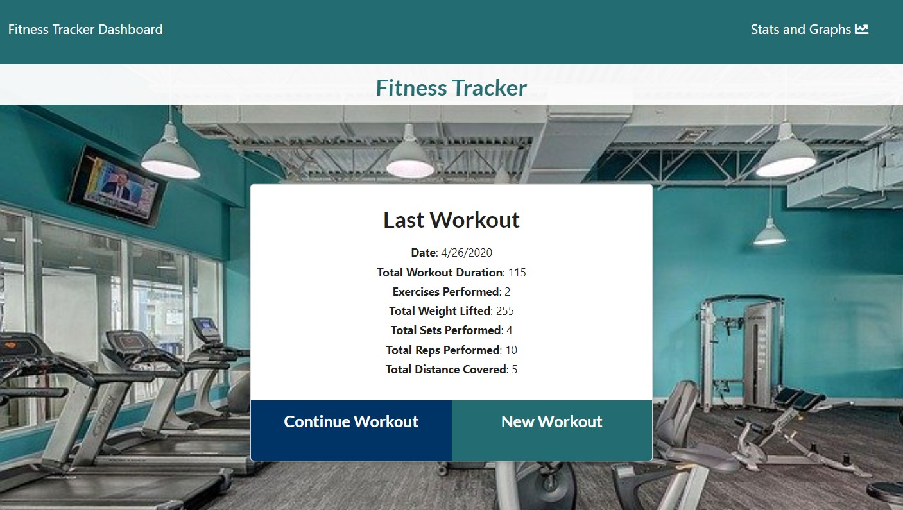
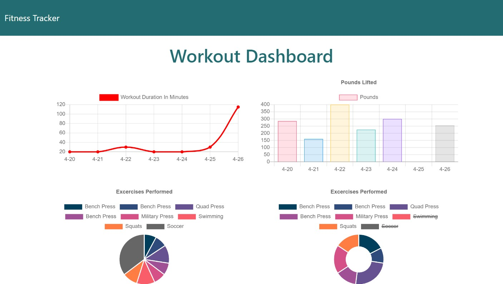

# Fitness-Time

  &nbsp;&nbsp;&nbsp; 	 
  &nbsp;&nbsp;&nbsp; 	 
  
 &nbsp;&nbsp;&nbsp; 	 
  

## Table of Contents

* [Description](#description)
* [Installation](#installation)
* [Usage](#usage)
* [Screenshots](#screenshots)
* [Built With](#built-with)

## Description

Fitness Time is a full-stack application that allows users to plan and record details about their exercise routines.  These workouts are saved in the mongoDB database and graphs are created using this information to display workout details for the previous week.

 * Here is the link to the deployed app on Heroku : https://fitness-time.herokuapp.com/

## Installation

 * Clone this repository from Github from the command line by typing:  
   `git clone https://github.com/alexcoulter/fitness-time.git`
  * Navigate to the 'fitness-time' folder by typing:  
  `cd fitness-time` 
  * Install dependencies by typing:  
   `npm install`
  * Run this application by typing:   
  `node server` 
  * Open this application in your browser by typing the url:
  `http://localhost:3000/`
  
  ## Usage
  
  * Once you have this application running on your local machine or Heroku you will be directed to the landing page. Here you will see information from your last workout.  If you want to see graphs from your last week's exercises, then click the link in the top-left corner that says 'Stats and Graphs'.  This will redirect you to the stats page.  To go back to the main page click the link in the top-left corner that says 'Fitness tracker'.  Here you can choose whether to continue your last workout or start a new one.  Use the textboxes to input your exercise details and if you're done click the button that says 'Complete'.  If you want to add another exercise, click the button that says 'Add Exercise'.
  
  ## Screenshots
* Landing Page

* Inputting Exercise

* Statistics Page

   
   ## Built With  

* **Node.js** -  JavaScript environment that executes JS code without needing a web browser
* **Express** - Web application framework that helped with routes and requests
* **MongoDB** - Flexible NoSQL database program
* **Mongoose** - Object modeling library for MongoDB